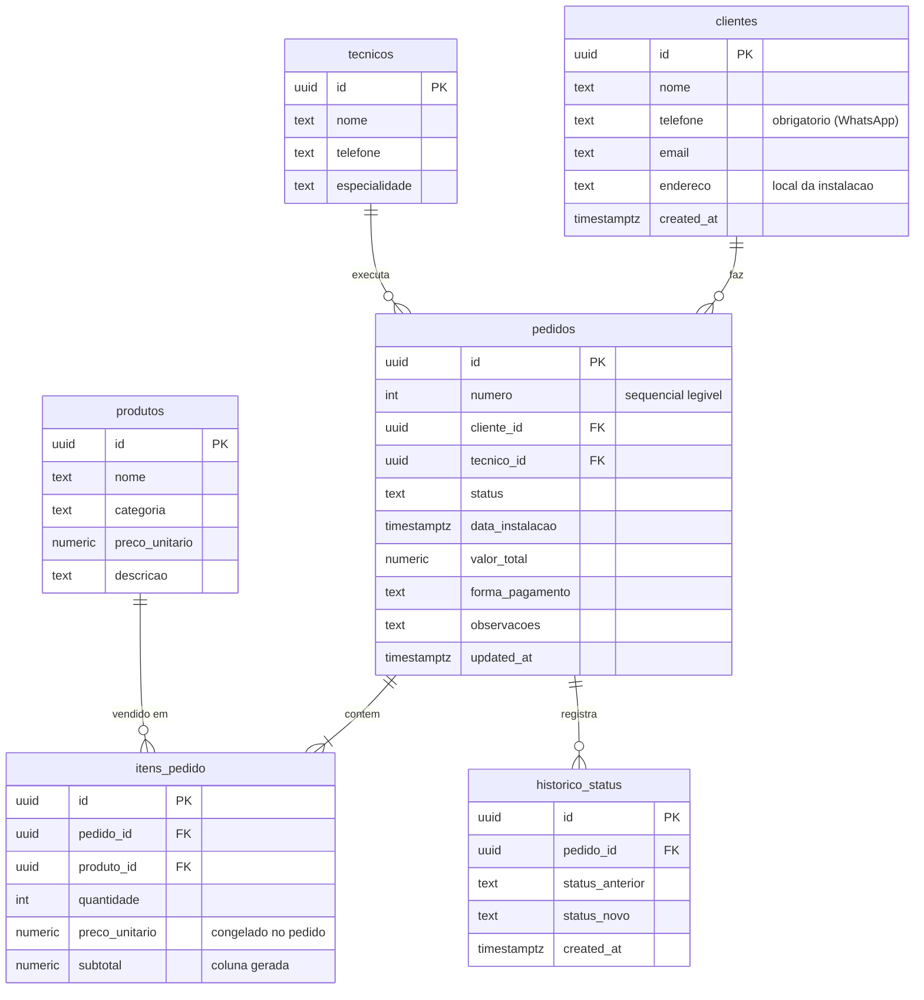

# SmartLar — Sistema de Gestão de Pedidos e Instalações

Sistema de gestão para a **SmartLar**, empresa fictícia de automação residencial (fechaduras digitais, câmeras, sensores, assistentes de voz e iluminação inteligente). Desenvolvido como **Teste Prático — Dev No-Code Junior (IAplicada, Processo Seletivo 2026)**.

**App no ar:** https://smartlar.lovable.app

O dono, Rafael, controlava tudo no WhatsApp e num caderninho. O sistema centraliza clientes, catálogo, pedidos (do orçamento à instalação), agenda dos técnicos e indicadores financeiros, e dispara automações no n8n a partir de dados reais do banco.

---

## Sumário

1. [Stack](#stack)
2. [Telas](#telas)
3. [Modelo de dados](#modelo-de-dados)
4. [Regras de negócio](#regras-de-negócio)
5. [Segurança (RLS)](#segurança-rls)
6. [Automações n8n](#automações-n8n)
7. [Como rodar localmente](#como-rodar-localmente)
8. [Estrutura do repositório](#estrutura-do-repositório)
9. [Decisões técnicas](#decisões-técnicas)
10. [Limitações e próximos passos](#limitações-e-próximos-passos)
11. [Uso de IA](#uso-de-ia)

---

## Stack

| Camada | Tecnologia |
|---|---|
| Frontend | React 19, TanStack Start / Router / Query, TypeScript |
| UI | Tailwind CSS 4, shadcn/ui (Radix), lucide-react, Recharts |
| Backend e banco | Supabase (PostgreSQL) via Lovable Cloud |
| Automações | n8n (workflows em [`n8n/`](./n8n)) |
| Testes | Vitest + Testing Library |
| Criação do front | Lovable |

---

## Telas

| Rota | Tela | O que faz |
|---|---|---|
| `/` | **Dashboard** | KPIs (pedidos do mês, faturado, a receber, pendentes de agendamento), próximas instalações (7 dias) e orçamentos aguardando aprovação. |
| `/clientes` | **Clientes** | Cadastro e lista com busca por nome ou telefone. |
| `/clientes/:id` | **Detalhe do cliente** | Pedidos do cliente. |
| `/produtos` | **Catálogo** | Produtos agrupados por categoria; cadastro de novo produto e edição de preço. |
| `/pedidos/novo` | **Novo pedido** | Seleciona (ou cadastra) o cliente, adiciona vários produtos com subtotal e total automáticos, observações, e salva como *orçamento*. |
| `/pedidos` | **Gestão de pedidos** | Lista com filtro por status. |
| `/pedidos/:id` | **Detalhe do pedido** | Cliente, itens, valores, técnico, datas, histórico de status e ações para avançar o status. Ao agendar, técnico e data são obrigatórios. |
| `/agenda` | **Agenda dos técnicos** | Seleciona o técnico e vê suas instalações; ele inicia e conclui a instalação direto da tela. |

---

## Modelo de dados



**Views** (usadas pelo n8n; `security_invoker`, respeitam o RLS):

- `vw_pedidos_detalhados` — pedido já com dados do cliente (nome, telefone, endereço) e do técnico.
- `vw_instalacoes_amanha` — pedidos `agendado` cujo `data_instalacao` cai **amanhã** no fuso `America/Sao_Paulo`.

**Dados de exemplo:** 5 clientes, 2 técnicos (Lucas — câmeras e sensores; Pedro — fechaduras e iluminação), produtos em 3 categorias e pedidos em todos os status (orçamento, aprovado, agendado, em andamento, concluído e cancelado).

---

## Regras de negócio

As regras vivem **no banco**, para valerem mesmo que o dado entre por outro caminho (n8n, SQL, outro front). O front as espelha só para dar uma boa experiência (`src/lib/smartlar.ts`).

- **Cálculo do total:** `subtotal` é coluna gerada (`quantidade × preco_unitario`). Um trigger recalcula `pedidos.valor_total` como a soma dos subtotais a cada insert, update ou delete de item. Exemplo: 2× Câmera IP (R$ 450) + 1× Sensor de presença (R$ 180) = **R$ 1.080,00**.
- **Preço congelado:** o item grava o `preco_unitario` do produto no momento da venda; mudar o preço no catálogo depois não altera pedidos antigos.
- **Criação atômica:** a função `criar_pedido(cliente, forma_pagamento, observacoes, itens)` cria pedido e itens numa transação e recusa pedido sem itens.
- **Fluxo de status** (função `transicao_valida`, aplicada pelo trigger `pedidos_validar`):

  ```
  orcamento → aprovado → agendado → em_andamento → concluido
  orcamento → cancelado
  aprovado  → cancelado
  ```

  Não há retorno de status nem saltos (ex.: `orcamento → em_andamento` é rejeitado pelo banco).
- **Agendamento exige técnico e data:** `agendado`, `em_andamento` e `concluido` só são aceitos com `tecnico_id` e `data_instalacao` preenchidos.
- **Histórico:** o trigger `trg_pedidos_historico` grava em `historico_status` cada criação e mudança de status, com data e hora.

---

## Segurança (RLS)

O RLS está **habilitado em todas as tabelas**. Como o sistema ainda não tem login, as políticas liberam leitura, inserção e atualização para os papéis `anon` e `authenticated` nas tabelas operacionais (`tecnicos` e `historico_status` são somente leitura, e pedidos e clientes não podem ser excluídos). Isso é suficiente para o escopo do teste, mas **não é adequado para produção**; veja [Limitações](#limitações-e-próximos-passos).

---

## Automações n8n

Os workflows estão em [`n8n/`](./n8n) e podem ser importados no n8n (*Workflows → Import from file*). Todos leem **dados reais do Supabase** via REST (`/rest/v1/...`) com a chave pública (*publishable*), a mesma do front.

| # | Arquivo | Gatilho | O que faz |
|---|---|---|---|
| 1 | [`n8n-01-novo-pedido.json`](./n8n/n8n-01-novo-pedido.json) | A cada 1 min | Consulta `vw_pedidos_detalhados`, e para cada pedido novo envia ao destino cliente, valor total e data de criação. |
| 2 | [`n8n-02-alerta-instalacao-amanha.json`](./n8n/n8n-02-alerta-instalacao-amanha.json) | Todo dia às 18h (São Paulo) | Consulta `vw_instalacoes_amanha` e envia um resumo com cliente, endereço, técnico e horário. |
| 3 *(bônus)* | [`n8n-03-faturamento-concluido-bonus.json`](./n8n/n8n-03-faturamento-concluido-bonus.json) | A cada 5 min | Lê `historico_status` (transições para `concluido`) e registra data, pedido, cliente, valor e forma de pagamento. Inclui nó Google Sheets desativado. |

### Como configurar

1. Importe os 3 arquivos no n8n.
2. Crie um endereço em [webhook.site](https://webhook.site) e cole a URL no campo `webhookUrl` do nó **Config** de cada workflow.
3. Ative os workflows (**Active**). A lista de itens já enviados usa *static data*, que só persiste com o workflow ativo.
4. *(Opcional, automação 3)* Crie uma planilha com as colunas `Data`, `Pedido`, `Cliente`, `Valor`, `Forma de pagamento`, conecte a credencial Google, informe o ID e ative o nó **Google Sheets (opcional)**.

### Como testar de ponta a ponta

1. No app, crie um pedido novo (`/pedidos/novo`). Em até 1 minuto a **automação 1** posta o pedido no webhook.
2. Avance o pedido até **concluído** (aprovar → agendar com técnico e data → iniciar → concluir). Em até 5 minutos a **automação 3** registra o faturamento.
3. Agende um pedido para amanhã. No horário das 18h (ou com *Execute workflow*) a **automação 2** envia o resumo.
4. Confira os logs em *Executions* no n8n.

### Decisões e tratamento de erro

- **Consulta periódica em vez de evento:** o n8n não tem trigger nativo de Supabase e a extensão `pg_net` não está habilitada. Além disso, `criar_pedido` insere o pedido com total 0 e só depois os itens, então um gatilho no INSERT enviaria R$ 0,00. A consulta filtra `valor_total > 0`, garantindo dado completo.
- **Sem duplicidade:** cada workflow guarda os IDs já enviados (últimos 500) e olha uma janela de `lookbackHoras` (padrão 24 h).
- **Sem agendamentos amanhã:** a automação 2 usa *Always Output Data* e envia "Nenhuma instalação agendada" com `total_instalacoes = 0`, para que o silêncio nunca seja ambíguo.
- **Falhas:** cada chamada HTTP tem 3 tentativas. Falha na consulta ao Supabase envia um alerta ao destino e marca a execução como erro. Falha no envio marca erro e o item é reenviado no ciclo seguinte.

---

## Como rodar localmente

Requisitos: Node.js 22+ (ou Bun) e um projeto Supabase com o schema aplicado.

```sh
git clone <url-do-repositorio>
cd <nome-do-repositorio>
npm install
npm run dev
```

Variáveis de ambiente (arquivo `.env`):

```
VITE_SUPABASE_URL=...
VITE_SUPABASE_PUBLISHABLE_KEY=...
```

| Comando | Função |
|---|---|
| `npm run dev` | Servidor de desenvolvimento |
| `npm run build` | Build de produção |
| `npm test` | Testes (Vitest) |
| `npm run lint` | ESLint |
| `npm run format` | Prettier |

---

## Estrutura do repositório

```
.
├── n8n/                      # Workflows do n8n (JSON importável)
├── drizzle/migrations/       # Migração do schema
├── supabase/                 # Configuração do Supabase
├── src/
│   ├── routes/               # Telas (TanStack Router, roteamento por arquivo)
│   ├── components/           # AppShell, StatusActions, ClienteFormDialog, common
│   │   └── ui/               # Componentes shadcn/ui
│   ├── lib/smartlar.ts       # Tipos, status, transições, formatadores e camada de acesso ao Supabase
│   ├── integrations/supabase # Cliente e tipos gerados do Supabase
│   └── test/                 # Testes
└── README.md
```

---

## Decisões técnicas

- **Regras no banco, não só no front:** status, total e obrigatoriedade de técnico/data são impostos por triggers e funções. O front apenas as reflete.
- **`subtotal` como coluna gerada e `valor_total` por trigger:** evita divergência entre itens e total, e o cálculo não depende de quem insere.
- **`preco_unitario` copiado para o item:** preserva o histórico de preços vendidos.
- **`historico_status` (bônus):** dá rastreabilidade e é a fonte do momento real de conclusão para o faturamento.
- **Views `security_invoker`:** simplificam as consultas do n8n sem contornar o RLS.
- **`numero` sequencial no pedido:** dá ao Rafael e ao cliente um identificador legível (`#0001`) no lugar do UUID.

---

## Limitações e próximos passos

- **Sem autenticação:** não há tela de login. Próximo passo: Supabase Auth e políticas RLS por usuário/papel (dono e técnico), em vez de acesso aberto a `anon`.
- **Chave pública no n8n:** as automações usam a chave *publishable*, que só enxerga o que o RLS libera. Ao restringir o RLS, o n8n precisará de uma credencial própria (por exemplo, um usuário de serviço).
- **Automações por consulta periódica:** a latência é de até 1 min (automação 1) e 5 min (automação 3). Com `pg_net` ou Database Webhooks o disparo seria instantâneo.
- **Estado do n8n em *static data*:** a deduplicação não sobrevive à troca de instância do n8n. O ideal é uma coluna `notificado_em` ou uma tabela de controle.
- **Fuso horário:** `data_instalacao` é `timestamptz`; a exibição e o alerta usam `America/Sao_Paulo` (UTC-3).
- **Sem notificação ao cliente:** um passo natural seria avisar o cliente por WhatsApp sobre status e agendamento.

---

## Uso de IA

- **Lovable:** geração do frontend e do schema do Supabase a partir do escopo do teste.
- **Claude (Anthropic):** leitura do enunciado, geração dos workflows n8n (JSON), revisão do banco. O funcionamento e as decisões foram revisados por quem submeteu o projeto.
